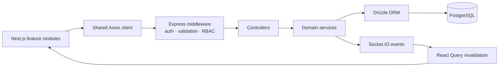

# WorkspaceOS

WorkspaceOS is a multi-tenant team workspace with secure authentication, hierarchical
RBAC, project boards, comments, labels, invitations, notifications, audit history, and
real-time collaboration.

**Project links:** [Frontend](http://localhost:3000) ·
[API](http://localhost:8000) · [API documentation](http://localhost:8000/api-docs) ·
[OpenAPI JSON](http://localhost:8000/api-docs.json)

These links target the local environment. Production URLs are deployment-specific; the
[Vercel + Render + Neon guide](docs/DEPLOYMENT.md) keeps their configuration explicit
instead of publishing unverified placeholders.

## The 60-second overview

Next.js renders the interface. Feature modules call a shared Axios client. Express
validates and authorizes requests, controllers coordinate them, services contain business
logic, Drizzle persists data in PostgreSQL, and Socket.IO triggers React Query refreshes.



The important architectural rule is tenant scope: workspace IDs are checked through
middleware and preserved in service queries, while PostgreSQL transactions protect
ownership changes, cascading operations, and audit records.

## What the product demonstrates

- Cookie-backed registration, login, session restoration, and logout
- Isolated workspaces with `OWNER → ADMIN → MANAGER → MEMBER → VIEWER` authorization
- Project CRUD and a five-column drag-and-drop Kanban board
- Task assignment, priority, due dates, archive, unarchive, duplicate, labels, and comments
- Secure, expiring workspace invitations and member administration
- Notifications, transactional audit history, and authenticated Socket.IO rooms
- Production health checks, graceful shutdown, Drizzle migrations, and Neon preview CI

## Where to start reading

1. `frontend/src/app` shows the thin Next.js route entry points.
2. `frontend/src/features/projects/ProjectBoardPage.tsx` shows React Query and optimistic
   Kanban updates.
3. `frontend/src/lib/api-client.ts` shows the shared credentialed Axios client and normalized
   errors.
4. `src/routes/task.route.ts` shows middleware composition.
5. `src/controllers/task.controller.ts` shows HTTP coordination.
6. `src/services/task.service.ts` shows tenant-scoped business logic and Drizzle access.
7. `src/socket.ts` and `frontend/src/features/collaboration/useWorkspaceSocket.ts` show the
   realtime refresh path.

## Five-minute demo

1. Register and create a workspace.
2. Create a project and open its board.
3. Create a task, assign it, add a due date, label, and comment.
4. Drag the task to another column and open the same workspace in a second browser.
5. Invite a teammate, change a role, then review notifications and audit activity.

Deep links such as
`/app/workspaces/:workspaceId/projects/:projectId?task=:taskId` remain directly
refreshable.

## Repository structure

```text
.
├── frontend/
│   └── src/
│       ├── app/                     # thin Next.js App Router entries
│       ├── components/
│       │   ├── app-shell/           # authenticated application shell
│       │   ├── shared/              # named application-level UI
│       │   └── ui/                  # consumed shadcn primitives only
│       ├── features/
│       │   ├── auth/                # sessions, login, registration, invitations
│       │   ├── workspaces/          # workspace context, dashboard, settings
│       │   ├── projects/            # projects, tasks, Kanban, labels, comments
│       │   └── collaboration/       # members, activity, notifications, realtime
│       ├── lib/                     # Axios client and shared utilities
│       └── types/
├── src/
│   ├── controllers/                 # request/response coordination
│   ├── middlewares/                 # auth, CSRF, validation, RBAC, errors
│   ├── routes/                      # endpoint composition
│   ├── schemas/                     # Zod request schemas
│   ├── services/                    # business logic and Drizzle queries
│   ├── db/schema/                   # PostgreSQL schema
│   ├── docs/openapi.ts
│   └── socket.ts
├── drizzle/                         # immutable migration history
├── tests/integration/
├── scripts/
├── docs/DEPLOYMENT.md
└── render.yaml
```

## Stack

The frontend uses Next.js, React, TypeScript, Tailwind CSS, shadcn/ui, TanStack Query,
Axios, React Hook Form, Zod, dnd-kit, Socket.IO Client, Lucide, and Sonner.

The backend uses Node.js, Express, TypeScript, PostgreSQL, Neon, Drizzle ORM, Zod,
Socket.IO, JWT, bcrypt, Helmet, CORS, express-rate-limit, Supertest, and the Node test
runner.

## Local setup

### Prerequisites

- Node.js `24.18.0` (`.nvmrc` is included)
- PostgreSQL or a Neon database
- Pooled and direct database connection strings for production workflows

Install dependencies:

```bash
nvm use
npm ci
npm --prefix frontend ci
```

Configure the backend:

```bash
cp .env.example .env
```

```env
NODE_ENV=development
PORT=8000
DATABASE_URL=<postgresql-url>
JWT_SECRET=<random-value-at-least-32-characters>
FRONTEND_URL=http://localhost:3000
TRUST_PROXY_HOPS=0
```

Configure the frontend:

```bash
cp frontend/.env.example frontend/.env
```

```env
NEXT_PUBLIC_API_URL=http://localhost:8000
```

Apply migrations, then start both applications:

```bash
npm run db:migrate
npm run dev
```

In a second terminal:

```bash
npm run frontend:dev
```

The browser never stores the JWT. Axios and Socket.IO send the backend's HttpOnly cookie
with credentials.

## Demo data

The seed is idempotent and only replaces the workspace with slug `workspaceos-demo`.
Unrelated records are not touched.

```bash
DEMO_SEED_CONFIRM=workspaceos-demo \
DEMO_SEED_PASSWORD='Use-A-Strong-Demo-Password' \
npm run db:seed:demo
```

The generated accounts are:

```text
owner@taskspace.demo
admin@taskspace.demo
member@taskspace.demo
viewer@taskspace.demo
```

All four use `DEMO_SEED_PASSWORD`. `DEMO_MODE=true` may be enabled for an authorized
portfolio deployment when invite links should be copyable from the UI.

## Verification

```bash
npm run verify
```

The verification pipeline checks formatting, backend source and test types, unit tests,
the backend build, the production dependency audit, frontend types, ESLint, and the
production Next.js build.

Integration tests require a migrated test database:

```bash
npm run test:integration
```

Other useful commands:

```bash
npm run format
npm run format:check
npm run test:coverage
npm run test:smoke
```

## Stable interfaces

The public routes include `/`, `/login`, `/register`, `/invite/:token`, `/app`, and the
workspace, project, member, activity, and settings routes below `/app/workspaces/:id`.

The backend documents 51 operations in Swagger. Errors retain this envelope:

```json
{
  "success": false,
  "code": "VALIDATION_ERROR",
  "message": "Validation failed",
  "errors": []
}
```

Security controls include HttpOnly production cookies, credentialed CORS, Origin/Referer
CSRF validation, rate limiting, Helmet headers, Zod validation, tenant-scoped queries,
hierarchical RBAC, hashed invitation tokens, bounded request bodies, stable error codes,
health probes, and graceful shutdown.

## Deployment

[`docs/DEPLOYMENT.md`](docs/DEPLOYMENT.md) covers the included Vercel frontend, Render API,
and Neon PostgreSQL workflow. `render.yaml`, `frontend/vercel.json`, and the GitHub Actions
workflows remain the deployment sources of truth.

## Author

Anugrah Singh
