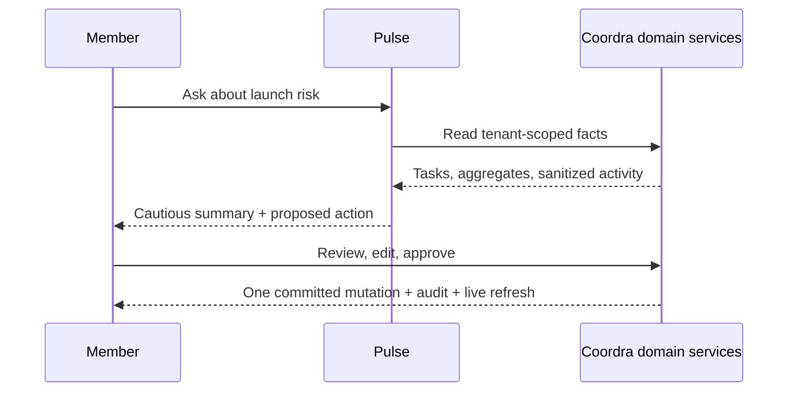
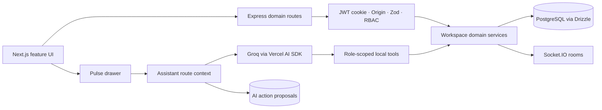

# Coordra

Coordra is an AI-assisted workspace for coordinating projects, people, and priorities.
It combines tenant-safe project delivery, live collaboration, and accountable actions with
Pulse: one workspace-scoped assistant that answers from verified facts and prepares writes
for explicit approval.

## Visual proof

The landing preview shows the core interaction: a member asks Pulse what needs attention,
Pulse summarizes deterministic risk conditions, and an editable proposal remains visibly
pending until approval. Inside the product, **Ask Pulse** opens a right-side desktop drawer
or full-screen mobile dialog while preserving the active workspace and project context.



## Five capabilities

1. **Projects and priorities** — projects, filtered Kanban tasks, due dates, assignees,
   labels, archive/restore, and duplication.
2. **People and permissions** — workspace membership, invitations, ownership transfer,
   and backend-enforced five-level RBAC. The recruiter demo focuses on Owner, Member, and
   Viewer while all five roles remain implemented.
3. **Context where work happens** — task comments, notification inboxes, and refresh-safe
   deep links.
4. **Live accountability** — Socket.IO workspace rooms, query invalidation, and
   transactional audit history.
5. **Pulse coordination** — workspace questions, deterministic risk summaries, and
   approval-gated create-task, update-task, and add-comment proposals.

## Architecture



Every tenant-owned lookup includes `workspaceId`. The AI adapter and tools never import
Drizzle; they call narrow domain reads. Conversation history is ephemeral and limited to
ten messages/12,000 characters. The raw audit endpoint remains Owner/Admin-only, while
Pulse sees sanitized activity labels and resource titles.

## Pulse safety model

- AI is optional and disabled by default; normal Coordra behavior does not depend on Groq.
- Read tools return at most 20 rows and are built from verified workspace/user/role context.
- Viewer receives four read tools. Member and above additionally receive three proposal
  tools. There is no delete tool.
- Tool inputs omit workspace IDs. Projects, tasks, and assignees are resolved by name
  against workspace-scoped service results; invented model UUIDs are never accepted.
- Risk severity is computed in TypeScript from database facts. The model only summarizes
  the returned conditions and next actions.
- Proposal tools store a 15-minute `PENDING` proposal but never execute a mutation.
- Approval is model-free: it revalidates identity, current role, ownership, workspace,
  expiry, and payload; atomically claims the pending row; runs the existing command and
  an `AI_ASSISTED_*` audit record in one transaction; then emits the live event after commit.
- Provider calls time out after 30 seconds. Disabled, quota, timeout, and provider failures
  return safe application errors without provider details.

## Setup

Prerequisites: Node.js 24.18+ and PostgreSQL 17 (a Neon URL also works).

```bash
npm ci
npm --prefix frontend ci
cp .env.example .env
cp frontend/.env.example frontend/.env
npm run db:migrate
DEMO_SEED_CONFIRM=coordra-demo DEMO_SEED_PASSWORD='<12+ characters>' npm run db:seed:demo
npm run dev
```

Run `npm run frontend:dev` in another terminal. The web app is at
`http://localhost:3000`, the API at `http://localhost:8000`, and Swagger at
`http://localhost:8000/api-docs`.

Pulse stays hidden with the default `AI_ENABLED=false`. To enable it on the backend:

```env
AI_ENABLED=true
AI_PROVIDER=groq
GROQ_API_KEY=<server-only-key>
GROQ_MODEL=openai/gpt-oss-20b
AI_MAX_STEPS=4
```

Never expose `GROQ_API_KEY` to Next.js or prefix it with `NEXT_PUBLIC_`.

## Behavior-based testing

```bash
npm run verify
```

Verification covers formatting, backend and test type checks, unit tests, PostgreSQL HTTP
journeys, Socket.IO behavior, production audits/builds, frontend lint/type checks, and
Vitest/Testing Library interaction tests. CI never calls Groq; Pulse generation accepts a
fake model generator in tests. Integration journeys exercise tenant isolation, RBAC,
proposal edit/reject/expiry, exactly-once approval, stale permissions, audit records, and
the ordinary SaaS routes with AI disabled.

## Limitations

- Pulse responses are non-streaming and conversations are not persisted.
- The deployment uses provider quota plus in-process hourly user/IP limiters; distributed
  rate-limit storage would be needed for a horizontally scaled API.
- Risk rules are intentionally explicit and conservative rather than predictive.
- Socket events use coarse invalidation, favoring correctness over minimal refetching.

## Future possibilities

Narrowly scoped follow-ups could add streaming presentation, a shared rate-limit store,
or additional deterministic read tools. Autonomous writes, deletion tools, persistent
conversation memory, RAG, MCP, queues, external integrations, and a separate AI service
are intentionally outside this implementation.

Engineering and deployment details live in [Deployment guide](docs/DEPLOYMENT.md) and
[Interview guide](docs/INTERVIEW_GUIDE.md).
