# Coordra 🌟

Coordra is an AI-assisted workspace for coordinating projects, people, and priorities. It combines tenant-safe project delivery, live collaboration, and accountable actions with Pulse: a workspace-scoped assistant that answers from verified facts and prepares writes for explicit approval.

🔗 **Live Demo:** https://saas-team-workspace.vercel.app/ (please wait for the backend server to start on render before doing anything)
<!-- 🔗 **Video Walkthrough:** [Link to a 2-minute Loom or YouTube video] -->

## 🚀 Key Features

- **Real-time Accountability:** Implemented Socket.IO workspace rooms with query invalidation to handle concurrent user interactions and ensure transactional audit history.
- **AI-Assisted Coordination (Pulse):** Integrated an approval-gated AI assistant that summarizes deterministic risk conditions and prepares editable task updates without executing autonomous mutations.
- **Contextual Workspaces:** Built seamless project management tools, including Kanban tasks, due dates, assignee management, and refresh-safe deep links where work actually happens.
- **Secure Authentication & Permissions:** Engineered a robust backend-enforced 5-level Role-Based Access Control (RBAC) system for secure workspace membership and tenant isolation.

## 🛠️ Tech Stack & Architecture

**Frontend**

- **Framework:** Next.js
- **Styling:** Tailwind CSS

**Backend**

- **Runtime Environment:** Node.js (v24.18+)
- **Framework:** Express.js
- **Database:** PostgreSQL (via Drizzle ORM)
- **AI Provider:** Groq (via Vercel AI SDK)

**System Workflow Diagram**

```mermaid
flowchart TD

subgraph group_backend["Node API"]
  node_server["Server bootstrap<br/>Node entry point<br/>[server.ts]"]
  node_express_app["Express API app<br/>HTTP composition<br/>[app.ts]"]
  node_api_routes["Domain API routes<br/>versioned HTTP routes<br/>[api.ts]"]
  node_security["Auth and RBAC gates<br/>middleware<br/>[auth.middleware.ts]"]
  node_auth_service["Identity service<br/>auth service<br/>[service.ts]"]
  node_socket_server["Workspace Socket.IO<br/>realtime server<br/>[socket.ts]"]
  node_openapi["OpenAPI docs<br/>API documentation<br/>[openapi.ts]"]
end

subgraph group_frontend["Next.js client"]
  node_next_app["Next.js app shell<br/>frontend entry<br/>[layout.tsx]"]
  node_project_board["Project board<br/>delivery UI"]
  node_workspace_socket["Workspace socket client<br/>realtime hook"]
  node_pulse_drawer["Pulse drawer<br/>assistant UI<br/>[PulseDrawer.tsx]"]
  node_invite_page["Invitation deep link<br/>invite UI<br/>[page.tsx]"]
end

subgraph group_delivery["Delivery domain"]
  node_workspace_service["Workspace membership<br/>workspace service<br/>[service.ts]"]
  node_project_service["Projects service<br/>project service<br/>[service.ts]"]
  node_task_service["Tasks service<br/>task service<br/>[service.ts]"]
  node_comment_service["Comments service<br/>comment service<br/>[service.ts]"]
end

subgraph group_ai["Pulse AI"]
  node_assistant_service["Assistant orchestration<br/>assistant service<br/>[service.ts]"]
  node_pulse_tools["Verified AI tools<br/>AI tool layer<br/>[tools.ts]"]
end

subgraph group_data["Persistence"]
  node_postgres[("PostgreSQL via Drizzle<br/>database access<br/>[index.ts]")]
  node_migrations["SQL migrations<br/>database migrations"]
end

node_server -->|"starts"| node_express_app
node_server -->|"hosts"| node_socket_server
node_express_app -->|"mounts"| node_api_routes
node_express_app -->|"applies"| node_security
node_api_routes -->|"identity requests"| node_auth_service
node_api_routes -->|"workspace requests"| node_workspace_service
node_api_routes -->|"project requests"| node_project_service
node_api_routes -->|"task requests"| node_task_service
node_api_routes -->|"comment requests"| node_comment_service
node_api_routes -->|"Pulse requests"| node_assistant_service
node_express_app -->|"mounts"| node_openapi
node_security -.->|"authorizes by membership"| node_workspace_service
node_workspace_service -->|"persists tenancy"| node_postgres
node_project_service -->|"persists"| node_postgres
node_task_service -->|"persists and audits"| node_postgres
node_comment_service -->|"persists"| node_postgres
node_task_service -->|"emits mutations"| node_socket_server
node_assistant_service -->|"uses verified reads"| node_pulse_tools
node_assistant_service -->|"stores proposals"| node_postgres
node_assistant_service -->|"executes approved actions"| node_task_service
node_migrations -->|"evolves schema"| node_postgres
node_next_app -->|"renders"| node_project_board
node_next_app -->|"routes to"| node_invite_page
node_project_board -->|"reads and mutates"| node_api_routes
node_workspace_socket -->|"subscribes to rooms"| node_socket_server
node_workspace_socket -.->|"refetches state"| node_api_routes
node_pulse_drawer -->|"submits and approves proposals"| node_api_routes

click node_server "https://github.com/anugrah-singh/coordra/blob/main/src/server.ts"
click node_express_app "https://github.com/anugrah-singh/coordra/blob/main/src/app.ts"
click node_api_routes "https://github.com/anugrah-singh/coordra/blob/main/src/domains/api.ts"
click node_security "https://github.com/anugrah-singh/coordra/blob/main/src/middlewares/auth.middleware.ts"
click node_auth_service "https://github.com/anugrah-singh/coordra/blob/main/src/domains/auth/service.ts"
click node_socket_server "https://github.com/anugrah-singh/coordra/blob/main/src/socket.ts"
click node_openapi "https://github.com/anugrah-singh/coordra/blob/main/src/docs/openapi.ts"
click node_workspace_service "https://github.com/anugrah-singh/coordra/blob/main/src/domains/workspaces/service.ts"
click node_project_service "https://github.com/anugrah-singh/coordra/blob/main/src/domains/projects/service.ts"
click node_task_service "https://github.com/anugrah-singh/coordra/blob/main/src/domains/tasks/service.ts"
click node_comment_service "https://github.com/anugrah-singh/coordra/blob/main/src/domains/comments/service.ts"
click node_assistant_service "https://github.com/anugrah-singh/coordra/blob/main/src/domains/assistant/service.ts"
click node_pulse_tools "https://github.com/anugrah-singh/coordra/blob/main/src/ai/tools.ts"
click node_postgres "https://github.com/anugrah-singh/coordra/blob/main/src/db/index.ts"
click node_next_app "https://github.com/anugrah-singh/coordra/blob/main/frontend/src/app/layout.tsx"
click node_project_board "https://github.com/anugrah-singh/coordra/blob/main/frontend/src/features/projects/ProjectBoardPage.tsx"
click node_workspace_socket "https://github.com/anugrah-singh/coordra/blob/main/frontend/src/features/collaboration/useWorkspaceSocket.ts"
click node_pulse_drawer "https://github.com/anugrah-singh/coordra/blob/main/frontend/src/features/assistant/PulseDrawer.tsx"
click node_invite_page "https://github.com/anugrah-singh/coordra/blob/main/frontend/src/app/invite/%5Btoken%5D/page.tsx"

classDef toneNeutral fill:#f8fafc,stroke:#334155,stroke-width:1.5px,color:#0f172a
classDef toneBlue fill:#dbeafe,stroke:#2563eb,stroke-width:1.5px,color:#172554
classDef toneAmber fill:#fef3c7,stroke:#d97706,stroke-width:1.5px,color:#78350f
classDef toneMint fill:#dcfce7,stroke:#16a34a,stroke-width:1.5px,color:#14532d
classDef toneRose fill:#ffe4e6,stroke:#e11d48,stroke-width:1.5px,color:#881337
classDef toneIndigo fill:#e0e7ff,stroke:#4f46e5,stroke-width:1.5px,color:#312e81
classDef toneTeal fill:#ccfbf1,stroke:#0f766e,stroke-width:1.5px,color:#134e4a
class node_server,node_express_app,node_api_routes,node_security,node_auth_service,node_socket_server,node_openapi toneBlue
class node_next_app,node_project_board,node_workspace_socket,node_pulse_drawer,node_invite_page toneAmber
class node_workspace_service,node_project_service,node_task_service,node_comment_service toneMint
class node_assistant_service,node_pulse_tools toneRose
class node_postgres,node_migrations toneIndigo
```


## 🧠 Technical Challenges & Key Learnings

💡 _Note for Reviewers: This section highlights my engineering mindset, problem-solving methodologies, and ability to overcome technical roadblocks during development._

**Challenge 1: Safe AI Mutations in a Multi-Tenant Environment**

- **The Problem:** Allowing an AI model to directly execute mutations on a database introduces severe security and data integrity risks, especially when dealing with tenant-isolated data.
- **The Solution:** I designed an approval-gated architecture where the AI generates a 15-minute `PENDING` proposal instead of directly executing writes. The approval process is model-free, atomically validating identity and roles before executing the command and emitting a live event.

**Challenge 2: Preventing LLM Hallucinations on Domain Data**

- **The Problem:** The AI could easily invent UUIDs or expose sensitive data from other tenants if given raw database access.
- **The Solution:** I implemented workspace-scoped service results. Tool inputs omit workspace IDs entirely, and projects/tasks are resolved by name against strictly verified workspace data. Risk severity is computed deterministically in TypeScript, leaving the model only responsible for summarizing safe conditions.

## 📦 Getting Started & Local Setup

**Prerequisites**
Make sure you have the following installed on your machine:

- Node.js (v24.18+)
- npm (v9.x or higher)
- A running instance of PostgreSQL 17 (or a Neon URL)

**Installation & Environment Configuration**
Clone the repository to your local machine:

```bash
git clone https://github.com/yourusername/coordra.git
cd coordra
```

Install the necessary dependencies for both the client and server:

```bash
# Install backend dependencies
npm ci

# Install frontend dependencies
npm --prefix frontend ci
```

Create a `.env` file in the root directory and frontend directory:

```bash
cp .env.example .env
cp frontend/.env.example frontend/.env
```

**Running the Application**
To launch the development server locally:

```bash
# Setup the database and seed it
npm run db:migrate
DEMO_SEED_CONFIRM=coordra-demo DEMO_SEED_PASSWORD='<12+ characters>' npm run db:seed:demo

# Run the backend
npm run dev
```

In another terminal, run the frontend:

```bash
npm run frontend:dev
```

The web app will be available at `http://localhost:3000`, the API at `http://localhost:8000`, and Swagger docs at `http://localhost:8000/api-docs`.

## 🔮 Future Improvements & Roadmap

- Implement a distributed rate-limit store to support horizontally scaled APIs.
- Add streaming presentation for Pulse AI responses.
- Integrate Redis for robust, distributed server-side caching.
- Expand deterministic read tools for the assistant.

