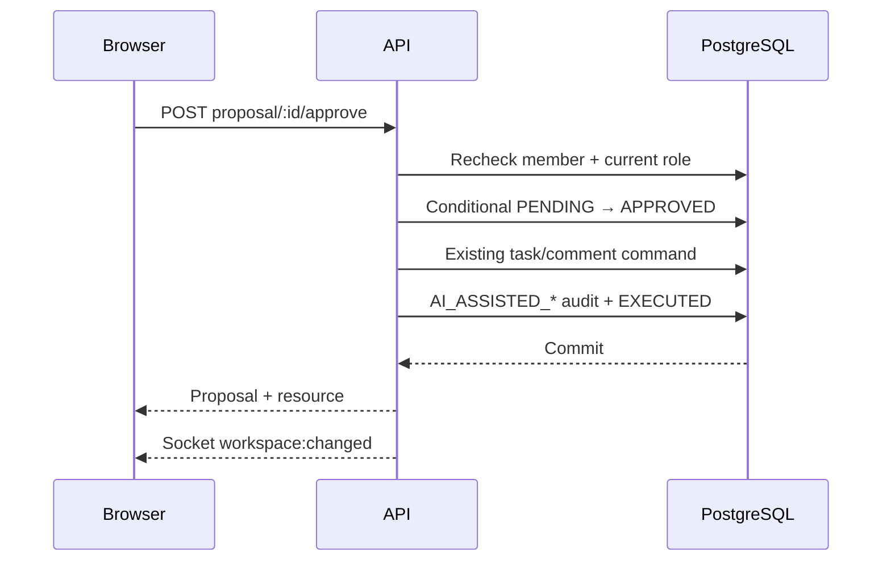

# Coordra interview guide

## 90-second architecture explanation

Coordra has a feature-first Next.js frontend and a domain-oriented Express API. A typed
fetch client sends credentialed requests through origin checks, rate limits, Zod
validation, JWT-cookie authentication, and workspace RBAC. Domain services scope every
tenant lookup by `workspaceId`; mutations and audits share PostgreSQL transactions.
Socket.IO emits coarse committed-change events and TanStack Query refetches authoritative
state.

Pulse is one optional coordinator inside that architecture, not a separate service. The
assistant route supplies verified workspace, user, role, project, date, and browser time
zone context. Vercel AI SDK calls Groq with four bounded model steps. Local tools call the
same domain reads and can store proposals, but they cannot mutate tasks/comments. Approval
is a separate model-free HTTP transaction.

## Pulse request trace

1. **Ask Pulse** sends one message plus at most ten browser-session messages.
2. Auth and workspace membership run before the dedicated per-user and IP limiters.
3. The route validates the 2,000-character message, 12,000-character history, project,
   and IANA time zone.
4. Role mapping exposes four read tools to Viewer and three proposal tools to Member+.
5. Tools omit `workspaceId`; their closure already contains the verified tenant context.
6. Tasks/comments/audit text is treated as untrusted data, never as model instructions.
7. The response includes prose, friendly completed-tool labels, and optionally a sanitized
   proposal. No conversation is written to the database.

## Approval transaction

Expiry returns 410, repeated/concurrent approval returns 409, and foreign workspace/user
access returns 404. An execution error rolls the resource mutation back and marks the
proposal `FAILED` separately without provider details.

## Deterministic risk model

High: incomplete and overdue, blocked, or urgent/unassigned tasks. Medium: backlog work
due within 48 hours, unfinished projects with seven days of inactivity, or a member with
more than five active tasks in scope. TypeScript derives these facts; Pulse only writes a
cautious summary and suggested next action.

## Recruiter demo: Owner, Member, Viewer

1. Sign in as `owner@coordra.demo`, open Product Launch, and ask Pulse for project risks.
2. Show that the returned conditions correspond to visible tasks rather than model guesses.
3. As `member@coordra.demo`, ask Pulse to create or update a task. Edit its structured card,
   read the exact localized due date, and approve it.
4. In the Owner browser, show the live refresh and `AI_ASSISTED_*` audit record.
5. As `viewer@coordra.demo`, ask a read question, then request a write and show the
   permission explanation with no actionable card.
6. Mention that Admin and Manager remain implemented for the full authorization hierarchy,
   but the recruiter story stays focused on these three roles.

## Security and failure drills

- Missing cookie → 401; below-role action → 403; cross-workspace target → 404/403.
- Untrusted Origin on an unsafe request → 403.
- AI disabled/provider timeout/quota → safe Pulse-only error; task boards remain usable.
- Duplicate approval → one 200 and one 409; only one resource exists.
- Role changed after proposal creation → approval revalidation denies stale authority.
- Raw audit history remains Owner/Admin-only; member-readable Pulse activity is sanitized.

## Testing strategy

Pure tests cover risk rules, name resolution, time zones, role-to-tool mapping, proposal
schemas, and fake model injection. PostgreSQL journeys cover auth, tenant isolation,
proposal edit/reject/expiry, stale permissions, exactly-once create/update/comment, and
audits. Frontend tests cover bounded history, friendly activity rendering, and retry
behavior. Existing workspace, collaboration, invitation, security, and socket journeys
remain in `npm run verify`; CI never calls Groq.

## Trade-offs

- Non-streaming, ephemeral chat keeps scope and privacy clear but offers less conversational
  continuity.
- Explicit risk rules are explainable but intentionally not predictive.
- In-process AI limits suit one Render instance; horizontal scaling needs shared storage.
- Coarse socket invalidation is simple and correct but refetches more than patched events.
- Five hierarchical roles are easy to demonstrate; capability-based permissions may fit a
  larger product later.
